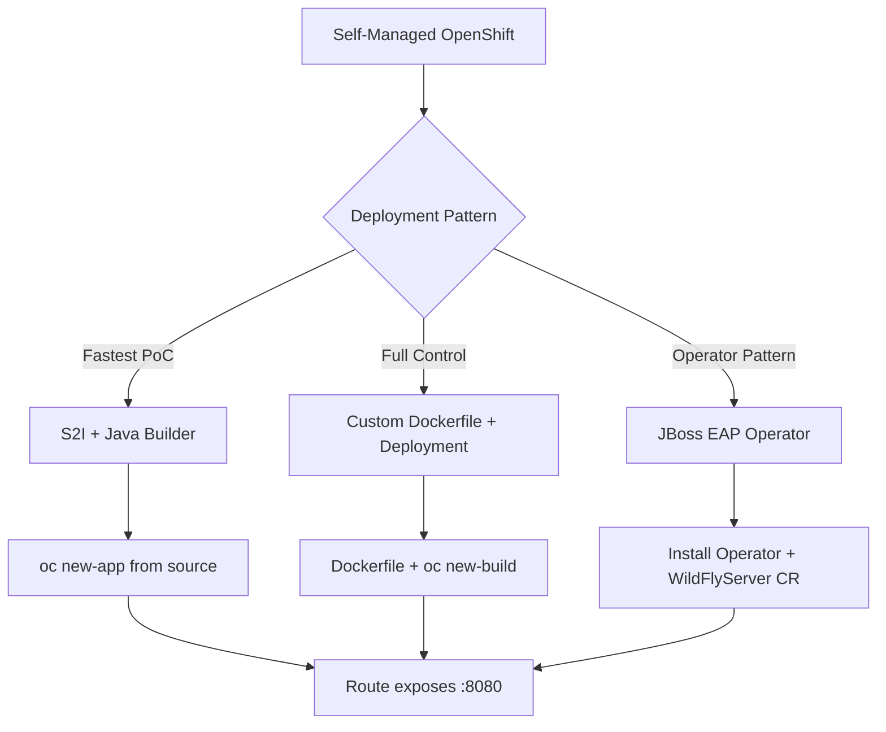

# OpenShift Tomcat Deployment Plan (PoC)

## Top-Level Overview

**Goal**: Deploy a minimal Tomcat application on a self-managed OpenShift cluster for learning/PoC purposes.

**Scope**: 
- Self-managed OpenShift cluster (no IBM Cloud specific services)
- Minimal working example to understand deployment patterns
- Preference for Operator-based management if available

**Approach**: Since there is no official "Tomcat Operator" on OperatorHub, this plan covers the three practical patterns for running Tomcat on OpenShift:
1. **S2I (Source-to-Image) with Red Hat Java Builder** - OpenShift-native, simplest for PoC
2. **Custom Dockerfile + Deployment** - Full control, production-ready pattern
3. **JBoss EAP Operator** - Red Hat supported operator for Java EE (includes Tomcat-like servlet container)

---

## Sub-Tasks

### Sub-Task 1: Environment Verification & Setup
**Intent**: Confirm OpenShift cluster access and CLI tools are configured.

**Expected Outcomes**:
- `oc` CLI logged into cluster
- Project/namespace created for Tomcat deployment
- Cluster version confirmed (affects available features)

**Todo List**:
- [ ] Verify `oc` CLI installed and configured
- [ ] Login to cluster: `oc login <api-url>`
- [ ] Create project: `oc new-project tomcat-poc`
- [ ] Check cluster version: `oc version`
- [ ] Verify registry access: `oc get imagestream -n openshift`

**Relevant Context**: 
- OpenShift docs: "Getting started with Red Hat OpenShift on IBM Cloud" - Deploy an app to your cluster
- Self-managed cluster may have different registry setup

---

### Sub-Task 2: Option A - S2I Deployment (Recommended for PoC)
**Intent**: Use OpenShift's Source-to-Image with Red Hat's Java builder image for fastest PoC.

**Expected Outcomes**:
- Tomcat app deployed via `oc new-app` from source code
- Build runs in-cluster, image stored in internal registry
- Application accessible via Route

**Todo List**:
- [ ] Create simple Java webapp (WAR) or use sample: `https://github.com/openshift/openshift-jee-sample`
- [ ] Deploy via S2I: `oc new-app --name tomcat-s2i redhat-openjdk18-openshift~https://github.com/<repo> --context-dir=<path>`
- [ ] Or use Java builder with Dockerfile strategy
- [ ] Expose service: `oc expose svc/tomcat-s2i`
- [ ] Verify: `curl $(oc get route tomcat-s2i -o jsonpath='{.spec.host}')`

**Relevant Context**:
- Red Hat provides `redhat-openjdk18-openshift` / `ubi8/openjdk-17` builder images
- S2I automatically detects Maven/Gradle projects
- Internal registry used automatically

**Decision Point**: If user has existing WAR file, use binary deployment: `oc new-app --name tomcat-s2i --docker-image=registry.redhat.io/redhat-openjdk-18/openjdk18-openshift --binary=true`

---

### Sub-Task 3: Option B - Custom Dockerfile + Deployment (Production Pattern)
**Intent**: Build custom Tomcat image with full control over configuration.

**Expected Outcomes**:
- Dockerfile builds Tomcat + app
- Image pushed to registry (internal or external)
- DeploymentConfig/Deployment manages pods
- Route exposes service

**Todo List**:
- [ ] Create Dockerfile:
  ```dockerfile
  FROM registry.redhat.io/rhel8/tomcat-9:latest
  COPY target/myapp.war /deployments/ROOT.war
  ```
- [ ] Build: `oc new-build --name tomcat-custom --dockerfile=<Dockerfile-path>`
- [ ] Or build locally + push: `podman build -t <registry>/tomcat-custom . && podman push`
- [ ] Create Deployment: `oc new-app --name tomcat-custom <image-stream>`
- [ ] Configure resources, probes, env vars
- [ ] Expose route

**Relevant Context**:
- Use Red Hat certified Tomcat image: `registry.redhat.io/rhel8/tomcat-9` or `registry.redhat.io/jboss-webserver-5/webserver55-tomcat9-openshift`
- OpenShift requires non-root user (UID 1000+), Tomcat images handle this
- SCC (Security Context Constraints) may need adjustment for port 8080

---

### Sub-Task 4: Option C - JBoss EAP Operator (Operator Pattern)
**Intent**: Use Red Hat's supported operator for Java EE workloads (closest to "Tomcat Operator").

**Expected Outcomes**:
- JBoss EAP Operator installed from OperatorHub
- WildFly/EAP instance managing servlet deployments
- Application deployed as `WildFlyServer` custom resource

**Todo List**:
- [ ] Install JBoss EAP Operator from OperatorHub (OperatorHub.io or embedded OperatorHub)
- [ ] Verify operator running: `oc get csv -n openshift-operators`
- [ ] Create `WildFlyServer` custom resource with app deployment
- [ ] Or use `JBossEAP` resource for managed deployment
- [ ] Expose service via Route

**Relevant Context**:
- JBoss EAP Operator is the Red Hat supported Java operator
- Manages WildFly (which includes Tomcat-compatible servlet container)
- Provides: automated updates, configuration management, clustering
- OperatorHub: `community-operators/jboss-eap-operator` or Red Hat certified version

**Note**: This is NOT a pure Tomcat operator - it manages WildFly/JBoss EAP which is a full Java EE server.

---

### Sub-Task 5: Validation & Testing
**Intent**: Verify deployment works and document access.

**Expected Outcomes**:
- Application accessible via browser/curl
- Logs visible: `oc logs -f deployment/tomcat-xxx`
- Scale test: `oc scale deployment/tomcat-xxx --replicas=3`
- Clean up: `oc delete project tomcat-poc`

**Todo List**:
- [ ] Test HTTP access via Route
- [ ] Check pod logs for startup errors
- [ ] Verify health checks (liveness/readiness)
- [ ] Test scaling
- [ ] Document access URL and credentials

---

## Architecture Decision



---

## Recommendations for PoC

| Factor | S2I (Option A) | Dockerfile (Option B) | JBoss EAP Operator (Option C) |
|--------|----------------|----------------------|-------------------------------|
| **Speed to PoC** | ⭐⭐⭐ Fastest | ⭐⭐ Medium | ⭐ Slowest (operator install) |
| **Learning Value** | OpenShift native | Container patterns | Operator pattern |
| **Production Ready** | Yes (with tuning) | Yes | Yes (Red Hat supported) |
| **Tomcat Fidelity** | Generic Java | Pure Tomcat | WildFly (servlet compat) |

**For pure learning/PoC**: Start with **Option A (S2I)** - it's the most OpenShift-native way and requires no operator installation.

**If operator pattern is required**: Use **Option C (JBoss EAP Operator)** - it's the closest available operator for Java servlet workloads on OpenShift.

---

## Next Steps

Please confirm:
1. Which option(s) you want to proceed with
2. Whether you have a sample WAR file or need a "Hello World" generated
3. If you have registry credentials (for Option B external registry)

Once confirmed, I'll switch to implementation mode and execute the chosen sub-task.